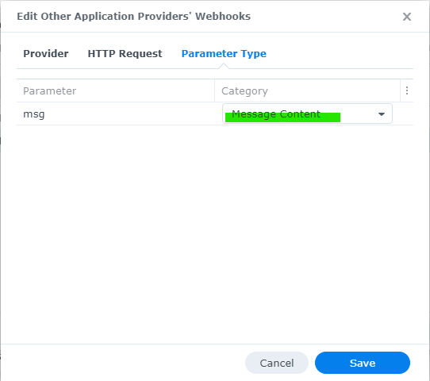

# synology-line-notify

## Introduction

This is a simple container image that listens on a specific port and converts the string passed in the http parameter into a format that LINE Notify can recognize and notify.

I created this because my Synology NAS DSM 7.x can use Webhook for event notification, but it cannot send directly to LINE Notify.

## How to use

### Direct use

To execute directly, do the following in an environment with GoLang

```bash
LINE_TOKEN=AAAAAAAAAAAAAAAAAAAAAAAAAAAAAAAAAAAAAAAAAAA go run notify.go
```

For LINE_TOKEN, specify your TOKEN obtained from https://notify-bot.line.me/

### Use as Docker container

Dockerfile is attached, so you can build and use this.

The following is an example of execution.

```bash
docker build -t synology-line-notify .
docker run -p 3000:8080 -e LINE_TOKEN=AAAAAAAAAAAAAAAAAAAAAAAAAAAAAAAAAAAAAAAAAAA synology-line-notify
```

You may use images from my repository available on DockerHub.

```bash
docker run -p 3000:8080 -e LINE_TOKEN=AAAAAAAAAAAAAAAAAAAAAAAAAAAAAAAAAAAAAAAAAAA katakura/synology-line-notify:latest
```

### for test

While the container is running using one of the above methods, check from another terminal with the curl command and confirm that notifications are sent to the LINE application.

```bash
curl "localhost:3000?msg=Hello%20world"
```


## Setup tips for DSM

My Synology NAS (DS220+) uses an Intel based CPU, so Docker is available.

This container image can be run directly on the Synology NAS and communicate with it on localhost.


In the control panel notification settings, the webhook was configured as follows

In the Provider tab, the msg parameter is given to localhost:3000 and sent.

```text
http://localhost:3000/?msg=Hello+world
```


Nothing is set in the HTTP Request tab


In the Parameter Type tab, set msg to Message Content



Finally, change the notification rules as needed and you're good to go!


